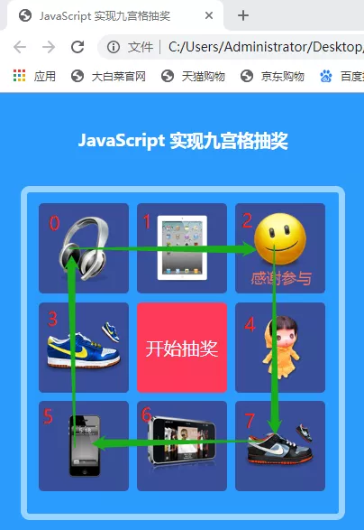

#### 代码分析
##### 1.prize
```
  var prize = [0,1,2,4,7,6,5,3];//奖品li标签滚动的顺序
```
数组prize中的数字就是li标签对应的索引值，由于是九宫格抽奖，因此抽奖滚动的顺序并不是按li标签的索引顺序，以下是li标签实际滚动的顺序图分析：



##### 2.getrandomnum(1,9)
```
  //抽中的奖品 返回1-9的整数，包含1，不包含9
  function getrandomnum(n, m) {
      return parseInt((m - n) * Math.random() + n);
  }
```
因为只有8个奖品，所以得到的随机整数不包含9

##### 3.变量 i、rounds、rNum
```
  var i = 0;  //定义一个i 用来计算抽奖跑动的总次数
  var rounds = 5;  //抽奖转动的圈数
  var rNum = rounds*8;  //标记跑动的次数（这是一个条件判断分界线）
```
i 是用来计算li标签滚动的次数，滚动一次加1；
rounds 及 rNum 用来让滚动抽奖变慢及停止的判断条件；

##### 4. prizenum
```
  var prizenum = prize[i%li.length];  //通过i余8得到此刻在prize数组中的数字，该数字就是mask标记出现的位置
  li[prizenum].className = "active";
```
i%li.length 为i除以li标签长度得到的余数(始终为0-7范围的整数)，放进prize数组中，得到的prizenum数字就是当前滚动到的li标签索引值